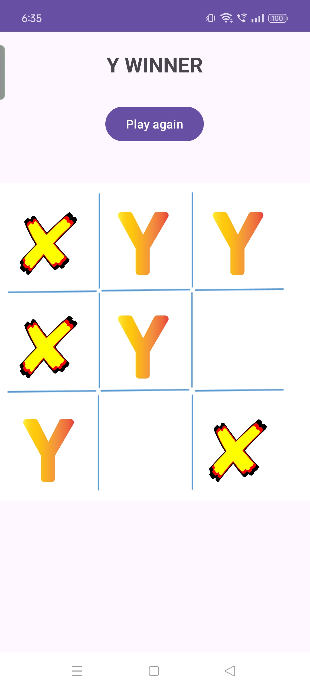

# Tic Tac Toe Game

This is a simple Tic Tac Toe game developed in Android using Java.


## 📷 Screenshots

<table>
<table style="width:100%">
  <tr>
    <td style="width:50%; text-align:center;"></td>
    <td style="width:50%; text-align:center;"></td>
  </tr>
  
</table>


## Features

- Classic 3x3 grid Tic Tac Toe game
- Two-player mode
- Simple and intuitive user interface

## Technologies Used:

- Android Studio
- Language: Java
- XML
## ⚠️ Requirements

- Android 5.0 (API level 21) and above

##  Installation

To get a local copy up and running, follow these steps:

1. **Clone the repository:**
   ```sh
   git clone https://github.com/Behrooz007/tic_tac_toe

2. **Open the project in Android Studio:**

Open Android Studio.
- Select File > Open and navigate to the directory - - where you cloned the project.
- Open the project.

3. **Build and Run the project:**

Connect your Android device or start an emulator.
Click the Run button in Android Studio or select Run > Run 'app'.
## Usage

Two Player Mode:

- Play against another player on the same device.
- Take turns to place X or O on the grid.


## 📜 License

The library is licensed under Apache 2.0.

